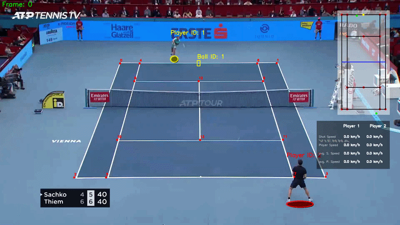

# Tenis_Analysts: Hệ thống phân tích video Tennis tự động

## Giới thiệu
Tenis_Analysts là một hệ thống phân tích video tennis tự động, được thiết kế để trích xuất các thông tin quan trọng từ các trận đấu tennis. Sử dụng các kỹ thuật thị giác máy tính và học sâu, hệ thống này có khả năng phát hiện người chơi và bóng, xác định đường kẻ sân, tính toán tốc độ bóng, tốc độ di chuyển của người chơi và trực quan hóa các dữ liệu này trên video đầu ra.




## Tính năng chính
*   **Phát hiện người chơi**: Sử dụng mô hình YOLOv8 để nhận diện và theo dõi người chơi trên sân.
*   **Phát hiện bóng**: Sử dụng mô hình tùy chỉnh để phát hiện và theo dõi bóng tennis.
*   **Phát hiện đường kẻ sân**: Xác định các đường kẻ trên sân tennis để chuẩn hóa tọa độ.
*   **Chuyển đổi tọa độ sân mini**: Chuyển đổi vị trí của người chơi và bóng từ tọa độ pixel sang một biểu diễn sân mini chuẩn hóa, giúp tính toán khoảng cách và tốc độ thực tế.
*   **Phát hiện cú đánh bóng**: Xác định thời điểm bóng được đánh trong trận đấu.
*   **Tính toán thống kê**: Đo lường tốc độ bóng, tốc độ di chuyển của người chơi và các chỉ số khác cho từng cú đánh.
*   **Trực quan hóa kết quả**: Vẽ các hộp giới hạn, đường kẻ sân, quỹ đạo bóng, vị trí trên sân mini và các chỉ số thống kê lên video đầu ra.

## Cài đặt

Để cài đặt và chạy dự án này, bạn cần có Python 3.8+ và pip.

### 1. Clone Repository
```bash
git clone https://github.com/thanhxuan2k5/Tenis_Analytics.git
cd Tenis_Analysts


### 2. Tạo và kích hoạt môi trường ảo (khuyến nghị)
```bash
python -m venv .venv
# Trên Windows
.venv\Scripts\activate
# Trên macOS/Linux
source .venv/bin/activate
```

### 3. Cài đặt các thư viện cần thiết
```bash
pip install -r requirements.txt
```

### 4. Tải xuống các mô hình đã huấn luyện
Dự án này sử dụng một số mô hình học sâu. Bạn cần tải chúng xuống và đặt vào đúng vị trí:

*   **Mô hình YOLOv8n (phát hiện người chơi)**:
    *   Tải xuống `yolov8n.pt` từ trang web chính thức của Ultralytics hoặc các nguồn đáng tin cậy khác.
    *   Đặt file `yolov8n.pt` vào thư mục gốc của dự án (`D:/Tenis_Analysts/`).

*   **Mô hình phát hiện bóng**:
    *   Tải xuống file `best.pt` (mô hình tùy chỉnh cho bóng).
    *   Tạo thư mục `model` nếu chưa có: `mkdir model`
    *   Đặt file `best.pt` vào thư mục `D:/Tenis_Analysts/model/`.

*   **Mô hình phát hiện đường kẻ sân**:
    *   Tải xuống file `keypoints_model.pth` (mô hình tùy chỉnh cho đường kẻ sân).
    *   Đặt file `keypoints_model.pth` vào thư mục `D:/Tenis_Analysts/model/`.

### 5. Chuẩn bị Video đầu vào
*   Tạo một thư mục có tên `input_videos` trong thư mục gốc của dự án (`D:/Tenis_Analysts/`).
*   Đặt file video tennis của bạn (ví dụ: `input_video.mp4`) vào thư mục `D:/Tenis_Analysts/input_videos/`.
    *   Đảm bảo tên file video trong `main.py` khớp với tên file bạn đặt. Mặc định là `input_video.mp4`.


```bash
python main.py
```

Chương trình sẽ xử lý video đầu vào, thực hiện phát hiện, theo dõi, tính toán thống kê và tạo ra một video đầu ra.

### Kết quả đầu ra
Video đã xử lý sẽ được lưu vào thư mục `output_videos/` với tên `output.mp4`.

## Cấu trúc dự án
```
Tenis_Analysts/
├── .venv/                      # Môi trường ảo Python
├── input_videos/               # Chứa video đầu vào (ví dụ: input_video.mp4)
├── model/                      # Chứa các mô hình đã huấn luyện (best.pt, keypoints_model.pth)
├── output_videos/              # Chứa video đầu ra đã xử lý (output.mp4)
├── tracker_stubs/              # Chứa các file .pkl để lưu trữ kết quả phát hiện tạm thời (cache)
├── trackers/                   # Chứa các lớp PlayerTracker và BallTracker
│   ├── __init__.py
│   ├── ball_tracker.py
│   └── player_tracker.py
├── utils/                      # Chứa các hàm tiện ích chung
│   ├── __init__.py
│   ├── video_utils.py
│   ├── conversions.py          # (Giả định)
│   └── ...
├── constants/                  # Chứa các hằng số của dự án
│   └── constants.py
├── court_line_detector/        # Chứa lớp CourtLineDetector
│   └── court_line_detector.py
├── mini_court/                 # Chứa lớp MiniCourt
│   └── mini_court.py
├── main.py                     # File thực thi chính của chương trình
├── yolov8n.pt                  # Mô hình YOLOv8n (phát hiện người chơi)
├── requirements.txt            # Danh sách các thư viện Python cần thiết
└── README.md                   # File mô tả dự án và hướng dẫn cài đặt
```

